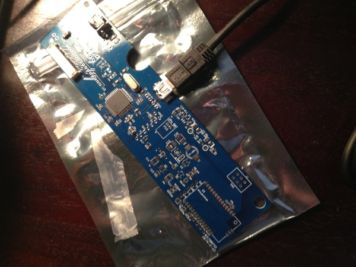
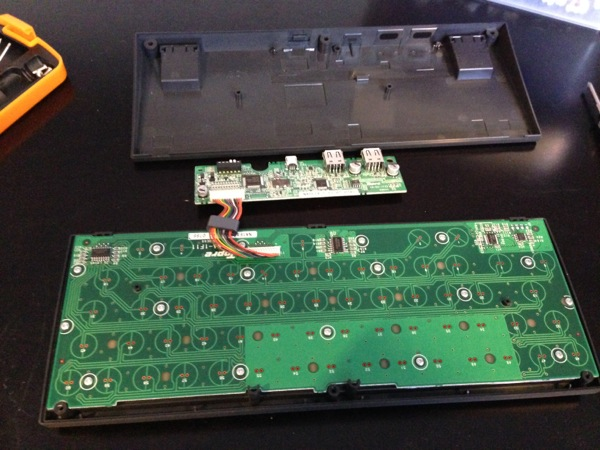
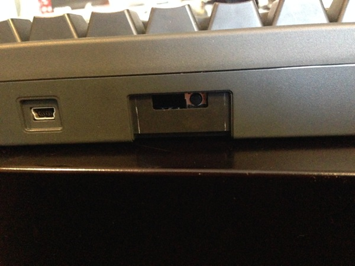

+++
title = "Modding the Happy Hacking Keyboard"
date = "2013-09-05"
+++

After reading [this post about hacking your HHKB][grumpy], I set out to do the
same thing. Now that I have the finished product, I can truly say that it is
freaking awesome to have a keyboard with **all your favorite keybindings set in the
hardware**. Basically I can now 'plug and go' into any computer and _it just
works_.

Being able to do this goes beyond the already awesome feel and sound of the
HHKB. A modded board is a whole different beast and this is what keyboard
nirvana feels like. No more feeling awkward about working on other computers!
Just bring your extremely portable modded keyboard ;)

Shamefully, as a programmer I've never been much of an electronics guy,
although I intend to change that. Originally I was gonna go with a Teensy 2
and try to hack all the hardware together, but [after finding this post on
Geekhack][geekhack] I decided against risking my precious as a guinea pig for
my first ever hardware mod, instead I purchased a complete board from a guy
who goes by **hasu on GeekHack**. If you would like a more detailed guide
about how to build this mod yourself, [Grumpy Lemming's guide][grumpy] is a
really good start.

Installation was surprisingly easy using Hasu's board. Everything was in the right
place - the board has a hole for the screw in the same spot as the original
board. He even made use of the dip switch location to expose the bootloader
reset button!





I want to avoid turning this post into a guide, if you get the completed board
from Hasu it is extremely straightforward. For complete instructions on
how to set this up with a Teensy again check out Grumpy Lemming's post. Instead I
want to focus on describing how I feel this new board has benefited me as a
programmer, and _why I think every programmer that likes to tweak their
workflow should try something like this out_.

I'm sure that possibilities are limited only to your imagination, but here are
a few of my favorite tweaks that can be easily programmed with the
[tmk_keyboard repo][tmk].

## #1 - Dual-purpose modifier keys

What has been the most powerful aspect of this for me are dual purpose modifier
keys. For example, the following makes the left control key act as `<ESC>` when
tapped, and `<CTRL>` when held down.

```cpp
static const uint16_t PROGMEM fn_actions[] = {
  // LControl with tap Esc*
  [2] = ACTION_MODS_TAP_KEY(MOD_LCTL, KC_ESC)
};
```

When working in VIM, you no longer have to reach up to the edge of the keyboard
in order to hit escape, just tap control on your home row :) This may take
some getting used to but I promise your fingers will thank you for it!

I realize the same thing can be achieved using something like
[KeyRemap4Macbook][keyremap]. But overall the flexibility, portability and
feel-rightness makes this a superior option!

## #2 - Numpad on the home row

The HHKB doesn't have a numpad. But even when I had a board that did, I rarely
used it - it was just too far away. With my current setup I have a numpad
centered around `J` on my home row. When I hold tab (using the same
dual-purpose modifier strategy as before), the _numpad layer_ is
switched on, something like this:

```
/* Layer 4: Numpad mode
  * ,-----------------------------------------------------------.
  * |Esc|   |   |   |   |   |   |   |   |   |   |   |   |   |   |
  * |-----------------------------------------------------------|
  * |FN0  |  |   |   |   |   | 7 | 8 | 9 | = |   |   |   |Backs|
  * |-----------------------------------------------------------|
  * |Contro|   |   |   |   |   | 4 | 5 | 6 | + |   |   |Return  |
  * |-----------------------------------------------------------|
  * |Shift   |   |   |   |   |   | 1 | 2 | 3 | - |   |Shift |   |
  * `-----------------------------------------------------------'
  *       |Alt|Gui  |           0           |Gui  |Alt|
  *       `-------------------------------------------'
  */
```

With this setup, numeric input can finally feel like it's part of the 'vi-flow'!

## #3 - Vi Mode

Although HHKB has some nice arrow key bindings, it never feels right after
prolonged use of VIM. My letter `f` key is now also dual purpose, and when held down
it activates vi-mode:

```
/* Layer 2: Vi mode
  * ,-----------------------------------------------------------.
  * |Esc| F1| F2| F3| F4| F5| F6| F7| F8| F9|F10|F11|F12|Ins|Del|
  * |-----------------------------------------------------------|
  * |Tab  |  |   |   |   |   |   |   |PgU|   |   |   |   |Backs|
  * |-----------------------------------------------------------|
  * |Contro|   |   |PgD|FN0|   |Lef|Dow|Up |Rig|   |   |Return  |
  * |-----------------------------------------------------------|
  * |Shift   |   |   |   |   |   |   |   |   |   |   |Shift |   |
  * `-----------------------------------------------------------'
  *       |Alt|Gui  |         Space         |Gui  |Alt|
  *       `-------------------------------------------'
  */
```

## #4 - Mouse Bindings

Yep, you can control the cursor with your keyboard! This is really just a
cool-show-off kinda thing but there have been some cases where it actually
gets useful, e.g changing focus between scrollable panes on a website. Again,
this time I made the escape button on the top left dual purpose - press for
`<esc>`, hold for mouse mouse. In mouse mode `hjkl` control movement, and the
space bar is left click. Like so:

```
/* Layer 3: Mouse mode
  * ,-----------------------------------------------------------.
  * |FN0| F1| F2| F3| F4| F5| F6| F7| F8| F9|F10|F11|F12|Ins|Del|
  * |-----------------------------------------------------------|
  * |Tab  |   |   |   |   |   |MwL|MwD|MwU|MwR|   |   |   |Backs|
  * |-----------------------------------------------------------|
  * |Contro|   |   |   |   |   |McL|McD|McU|McR|   |   |Return  |
  * |-----------------------------------------------------------|
  * |Shift   |   |   |   |   |Mb3|Mb2|Mb1|Mb4|Mb5|   |Shift |   |
  * `-----------------------------------------------------------'
  *      |Alt |Gui  |          Mb1          |Gui  |Alt|
  *      `--------------------------------------------'
  * Mc: Mouse Cursor / Mb: Mouse Button / Mw: Mouse Wheel
  */
```

There must be plenty of other tweaks and hacks that I haven't thought of.
I'm still continuously tweaking the key mappings in search of that holy grail of
key-bindings - it's been such an enjoyable experience.

### Updates

Here are some other tweaks that I've adopted so far:

- `LSFT` becomes left parenthesis on tap, `RSFT` is right
  parenthesis. This one actually came with the `tmk_keyboard` repo as an
  existing macro, since there is no real key code to send for the parenthesis'.

- Remap `esc` to `tilde`, I still can't get used to the replaced tilde
  for escape next to the `1` key, since I've got tap `LCTL` for escape now, no
  longer need the original one.

[grumpy]: http://grumpylemming.com/blog/2012/12/24/hacking-a-happy-hacking-keyboard/
[geekhack]: http://geekhack.org/index.php?topic=12047.0
[tmk]: https://github.com/tmk/tmk_keyboard
[keyremap]: https://pqrs.org/macosx/keyremap4macbook/
